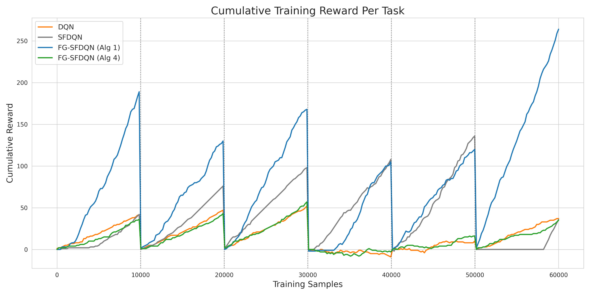
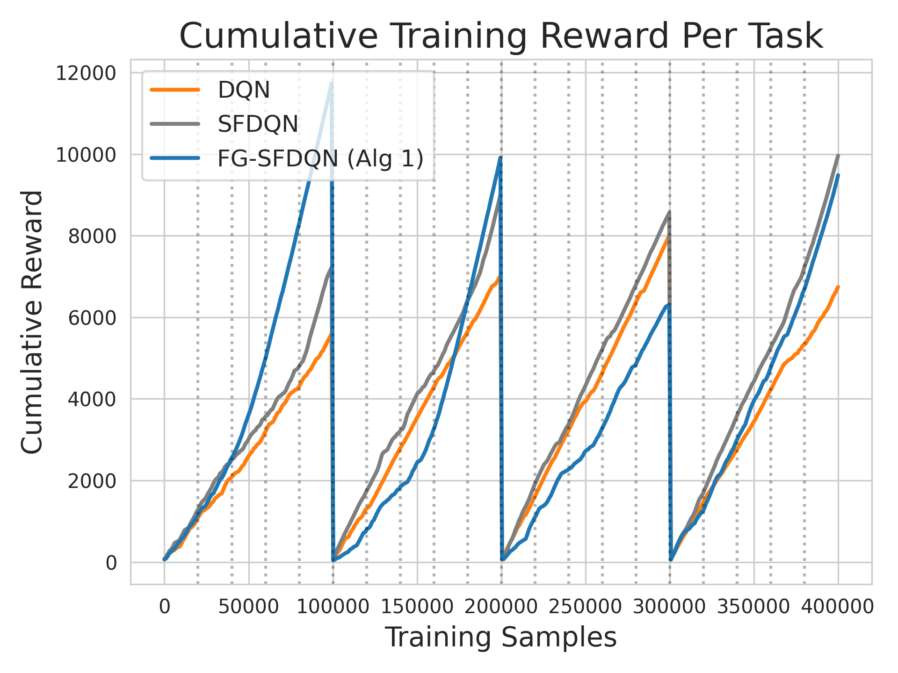
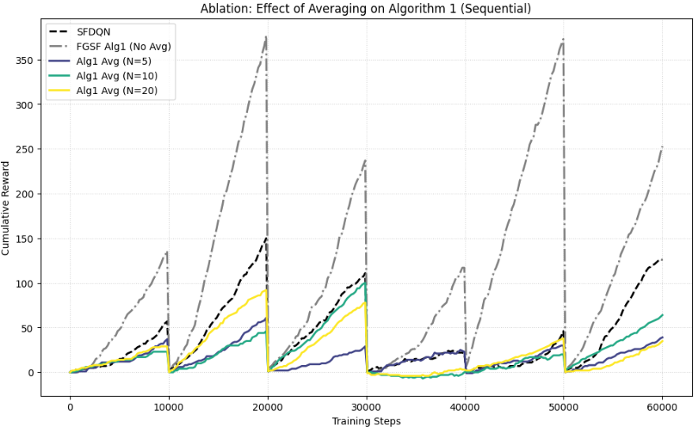
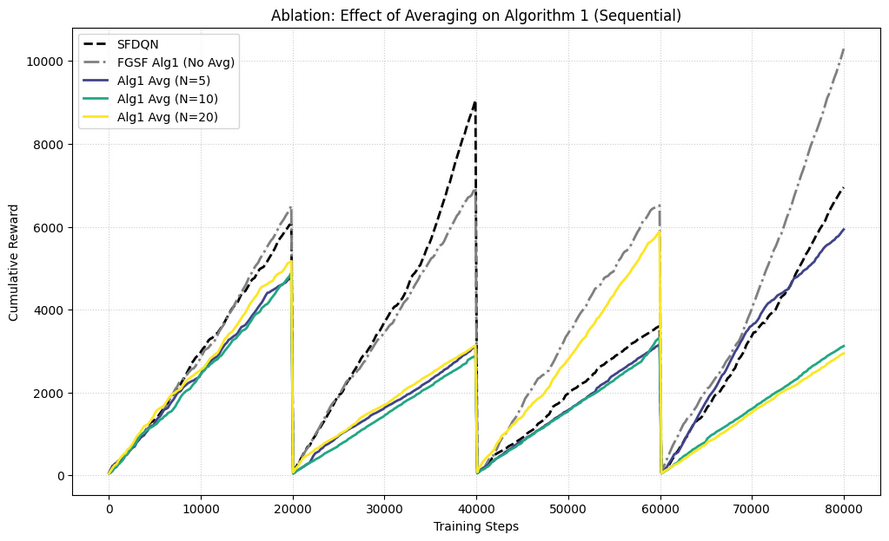
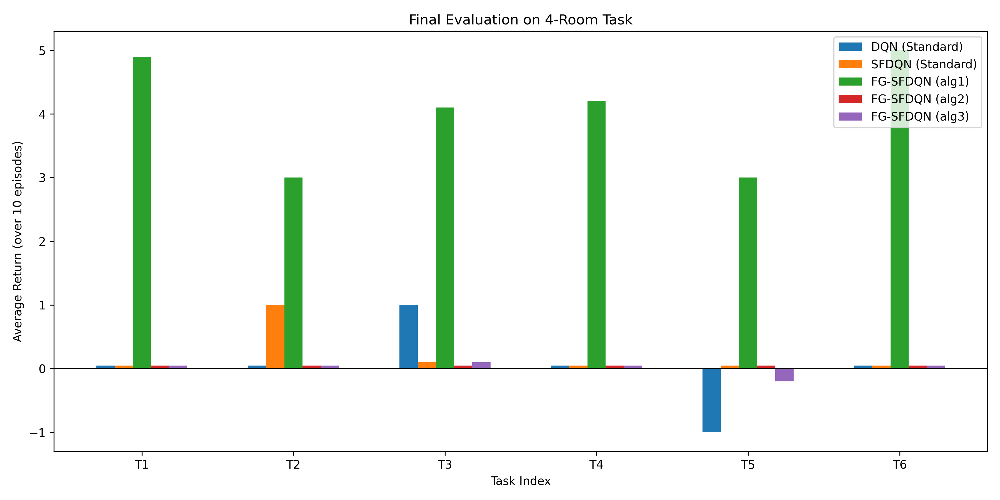
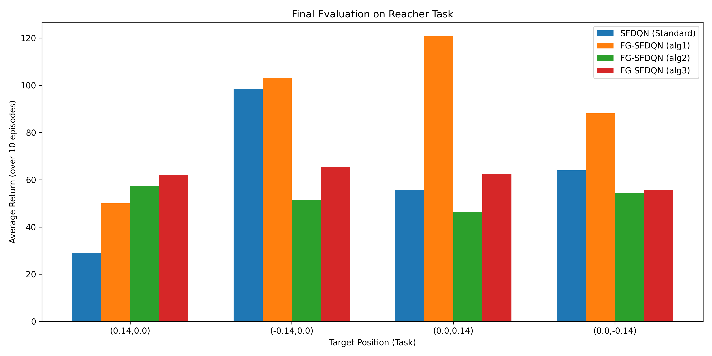

# FG-SFDQN: Full-Gradient Successor Feature DQN


This repository contains the implementation of **FG-SFDQN**, a framework that extends **Successor Feature DQN (SFDQN)** by performing **full-gradient minimization of the Bellman residual**. The approach is designed to improve **sample efficiency, **training stability**, and **transfer performance**.

We empirically compare:
- **DQN** (standard value-based baseline),
- **SFDQN** (semi-gradient successor feature learning), and
- **FG-SFDQN** (our proposed full-gradient variants),

across two benchmark domains:
- a discrete **4-Room GridWorld** with object-based rewards, and
- a continuous-control **Reacher** task implemented in PyBullet.

---

## Installation

### Requirements

Install core dependencies:
```bash
pip install torch numpy matplotlib configparser
````

### PyBullet Setup (for Reacher)

```bash
pip install pybullet
pip install "gym<0.26"

git clone https://github.com/benelot/pybullet-gym.git
cd pybullet-gym
pip install -e .
```

---

## Environments

### 4-Room GridWorld

* Discrete navigation with object collection.
* Tasks differ by **reward vectors over object types**.
* State encoding includes agent position and object memory.

### Reacher (PyBullet)

* Continuous robotic arm reaching task (discretized actions).
* Tasks differ by target positions:
  ```
  (0.14, 0.0), (-0.14, 0.0), (0.0, 0.14), (0.0, -0.14)
  ```
* State includes joint angles, velocities, and relative target coordinates.

---

## Algorithms

### DQN

Standard Deep Q-Network trained independently per task, without transfer.

### SFDQN

Semi-gradient successor feature learning with Generalized Policy Improvement (GPI), following [Barreto et al](https://arxiv.org/abs/1606.05312).

### FG-SFDQN (Ours)

Minimizes the **full Mean Squared Bellman Error (MSBE)** by differentiating through both the prediction and the bootstrap target.

Implemented variants:

* **Alg 1 (Sequential FG-SFDQN)**: Full-gradient updates with GPI-based assignment.
* **Alg 2 (Randomized Tasks)**: Random task sampling for stationary training.
* **Alg 3 (Randomized + Averaging)**: Conditional replay with averaging over next-state encodings.

---

## Running Experiments

All scripts are located in `experiments/`.

### Training Curves

```bash
cd experiments
python training_comparison_4room.py
python training_comparison_reacher.py
```

### Averaging Ablation

```bash
cd experiments
python averaging_4room.py
python averaging_reacher.py
```

### Final Evaluation

```bash
cd experiments
python final_eval_4room.py
python final_eval_reacher.py
```

Evaluation reports average return over 10 test episodes per task.

---

## Results

### Training Performance (4-Room & Reacher)




FG-SFDQN (Alg 1) consistently achieves **higher cumulative reward in the low-sample regime**, demonstrating faster adaptation following task switches.

---

### Averaging Ablation




Averaging next-state encodings generally **degrades performance**, likely due to off-manifold targets and bias introduced in Bellman updates.

---

### Final Evaluation

#### 4-Room Tasks




FG-SFDQN (Alg 1) achieves **consistently positive returns across all tasks**, while DQN and SFDQN frequently fail to generalize.

---

## Key Findings

* **FG-SFDQN (Alg 1)** provides the best overall performance.
* In **4-Room**, FG-SFDQN achieves nearly **2× cumulative reward** compared to SFDQN.
* In **Reacher**, FG-SFDQN consistently outperforms semi-gradient baselines.


See the [report](report.pdf) for theoretical guarantees and detailed analysis.


